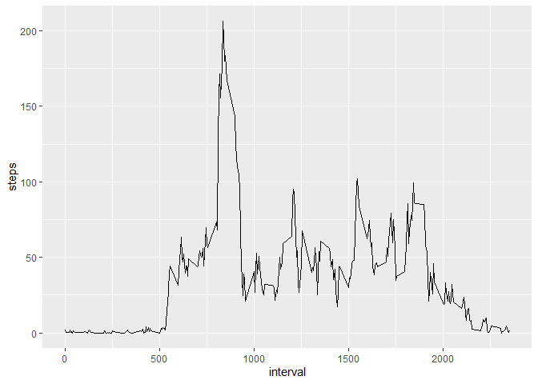

    


### **Loading and preprocessing the data**

#### 1.Loading data

```r
data<-read.csv("activity.csv")
```
#### 2.Preprocessing of data

```r
data$date<-as.Date(data$date)
```


### **Mean total number of steps taken per day**

#### 1.Total number of steps taken per day

```r
# create and print number of steps per day
StepsPerDay <- aggregate(data$steps, list(data$date), FUN=sum)
colnames(StepsPerDay) <- c("Date", "Steps")
StepsPerDay
```

```
##          Date Steps
## 1  2012-10-01    NA
## 2  2012-10-02   126
## 3  2012-10-03 11352
## 4  2012-10-04 12116
## 5  2012-10-05 13294
## 6  2012-10-06 15420
## 7  2012-10-07 11015
## 8  2012-10-08    NA
## 9  2012-10-09 12811
## 10 2012-10-10  9900
## 11 2012-10-11 10304
## 12 2012-10-12 17382
## 13 2012-10-13 12426
## 14 2012-10-14 15098
## 15 2012-10-15 10139
## 16 2012-10-16 15084
## 17 2012-10-17 13452
## 18 2012-10-18 10056
## 19 2012-10-19 11829
## 20 2012-10-20 10395
## 21 2012-10-21  8821
## 22 2012-10-22 13460
## 23 2012-10-23  8918
## 24 2012-10-24  8355
## 25 2012-10-25  2492
## 26 2012-10-26  6778
## 27 2012-10-27 10119
## 28 2012-10-28 11458
## 29 2012-10-29  5018
## 30 2012-10-30  9819
## 31 2012-10-31 15414
## 32 2012-11-01    NA
## 33 2012-11-02 10600
## 34 2012-11-03 10571
## 35 2012-11-04    NA
## 36 2012-11-05 10439
## 37 2012-11-06  8334
## 38 2012-11-07 12883
## 39 2012-11-08  3219
## 40 2012-11-09    NA
## 41 2012-11-10    NA
## 42 2012-11-11 12608
## 43 2012-11-12 10765
## 44 2012-11-13  7336
## 45 2012-11-14    NA
## 46 2012-11-15    41
## 47 2012-11-16  5441
## 48 2012-11-17 14339
## 49 2012-11-18 15110
## 50 2012-11-19  8841
## 51 2012-11-20  4472
## 52 2012-11-21 12787
## 53 2012-11-22 20427
## 54 2012-11-23 21194
## 55 2012-11-24 14478
## 56 2012-11-25 11834
## 57 2012-11-26 11162
## 58 2012-11-27 13646
## 59 2012-11-28 10183
## 60 2012-11-29  7047
## 61 2012-11-30    NA
```


#### 2.Histogram of the total number of steps taken each day

```r
sum_steps<-aggregate(data$steps,by=list(data$date),FUN=sum,na.rm=TRUE) 

hist(sum_steps$x, breaks=seq(from=0, to=25000, by=2500),col="lightblue", xlab="Total number of steps", ylim=c(0,20), main="Histogram of the total number of steps taken each day\n(NA removed)")
```

<!-- -->


#### 3.Mean and median number of steps taken each day

```r
mean(sum_steps$x)
```

```
## [1] 9354.23
```


```r
median(sum_steps$x)
```

```
## [1] 10395
```


### **The average daily activity pattern**

#### 1.Time series plot of the average number of steps taken 

```r
avg_steps<-aggregate(data$steps,by=list(data$interval),FUN=mean,na.rm=TRUE)

colnames(avg_steps)<-c("interval","steps")

ggplot(aes(x=interval,y=steps),data=avg_steps)+geom_line()
```

<!-- -->


#### 2.The 5-minute interval that, on average, contains the maximum number of steps


```r
mostSteps <- which.max(avg_steps$steps)
timeMostSteps <-  gsub("([0-9]{1,2})([0-9]{2})", "\\1:\\2", avg_steps[mostSteps,'interval'])
timeMostSteps
```

```
## [1] "8:35"
```


### **Imputing missing values**


#### 1.The total number of missing values in the dataset

```r
sum(is.na(data$steps))
```

```
## [1] 2304
```


#### 2.Replace missing values with the mean of the steps


```r
data$steps[is.na(data$steps)]<-mean(data$steps,na.rm=TRUE)
```


#### 3.New dataset that is equal to the original dataset but with the missing data filled in

```r
head(data)
```

```
##     steps       date interval
## 1 37.3826 2012-10-01        0
## 2 37.3826 2012-10-01        5
## 3 37.3826 2012-10-01       10
## 4 37.3826 2012-10-01       15
## 5 37.3826 2012-10-01       20
## 6 37.3826 2012-10-01       25
```


#### 4.Histogram of the total number of steps taken each day with missing data filled in

```r
sum_steps<-aggregate(data$steps,by=list(data$date),FUN=sum,na.rm=TRUE) 

hist(sum_steps$x,breaks=seq(from=0, to=25000, by=2500),col="lightblue", xlab="Total number of steps", ylim=c(0, 30 ), main="Total number of steps taken each day\n(NA replaced by mean)")
```

<!-- -->


##### The mean and the median total number of steps taken per day

```r
mean(sum_steps$x)
```

```
## [1] 10766.19
```

```r
median(sum_steps$x)
```

```
## [1] 10766.19
```


##### Imputing missing data have only a little and transcurable impact on the mean ant the median of the total daily number of steps. According to the histogram, we can note than the only bin that is changed is the interval between 10000 and 12500 steps, grown from some frequency. Different methods for replace missing values could cause different results.


### **Differences in activity patterns between weekdays and weekends**

#### 1.A new factor variable in the dataset with two levels - “weekday” and “weekend” indicating whether a given date is a weekday or weekend day

##### DayType is the new column indicating if the day is a weekday day or a weekend day: the first ten values of the new table are shown below


```r
# Create variable with date in correct format
data$RealDate <- as.Date(data$date, format = "%Y-%m-%d")

# create a variable with weekdays name
data$weekday <- weekdays(data$RealDate)

# create a new variable indicating weekday or weekend
data$DayType <- ifelse(data$weekday=='Saturday' | data$weekday=='Sunday', 'weekend','weekday')

# see first 10 values
head(data, n=10)
```

```
##      steps       date interval   RealDate weekday DayType
## 1  37.3826 2012-10-01        0 2012-10-01  Monday weekday
## 2  37.3826 2012-10-01        5 2012-10-01  Monday weekday
## 3  37.3826 2012-10-01       10 2012-10-01  Monday weekday
## 4  37.3826 2012-10-01       15 2012-10-01  Monday weekday
## 5  37.3826 2012-10-01       20 2012-10-01  Monday weekday
## 6  37.3826 2012-10-01       25 2012-10-01  Monday weekday
## 7  37.3826 2012-10-01       30 2012-10-01  Monday weekday
## 8  37.3826 2012-10-01       35 2012-10-01  Monday weekday
## 9  37.3826 2012-10-01       40 2012-10-01  Monday weekday
## 10 37.3826 2012-10-01       45 2012-10-01  Monday weekday
```


#### 2.Two time series plot of the 5-minute interval (x) and the average number of steps taken averaged across weekday days or weekend days (y)


```r
# Convert date into weekdays
data$days=tolower(weekdays(data$date))

#Now categorised days into weekend and weekdays
data$day_type<-ifelse(data$days=="saturday"|data$days=="sunday","weekend","weekday")

#Take mean steps taken on weekend or weekday in the intervals
avg_steps<-aggregate(data$steps,by=list(data$interval,data$day_type),FUN=mean,na.rm=TRUE)

colnames(avg_steps)<-c("interval","day_type","steps")

# Create panel plot between average steps and interval seperated by day type
ggplot(aes(x=interval,y=steps),data=avg_steps)+geom_line()+facet_wrap(~avg_steps$day_type)
```

<!-- -->


